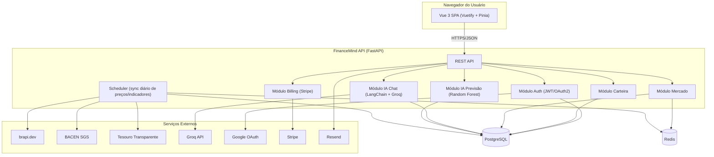
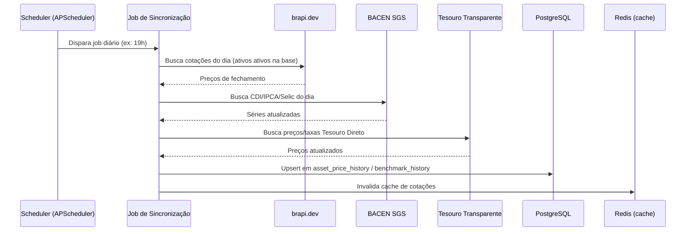
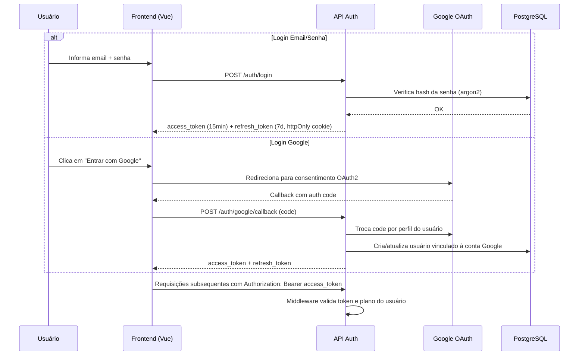
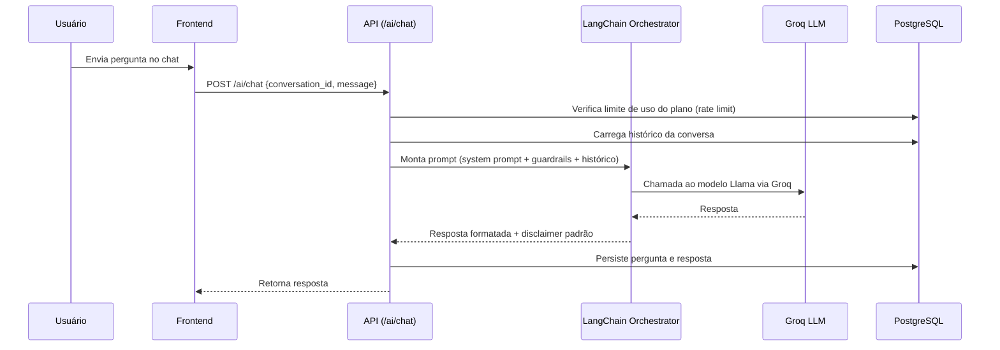
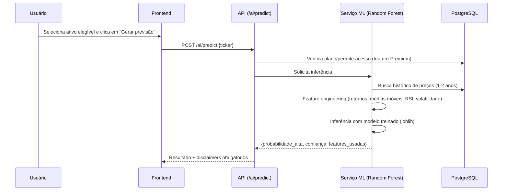

# 2. Arquitetura Técnica

## 2.1 Stack

| Camada | Tecnologia |
|---|---|
| Frontend | Vue 3 (Composition API) + TypeScript + Pinia + Vue Router + Vuetify 3 + ApexCharts + Axios + vue-i18n |
| Backend | Python 3.12 + FastAPI + Pydantic v2 |
| ORM / Migrations | SQLAlchemy 2.0 (async) + Alembic |
| Banco de dados | PostgreSQL (Docker local em dev, Supabase em produção) |
| Autenticação | JWT (access + refresh) + OAuth2 Google |
| Cache / Jobs | Redis (cache de cotações + fila de jobs com APScheduler ou Celery leve) |
| IA — Chat | LangChain + Groq API (Llama 3.x), camada de abstração de provider |
| IA — Previsão | scikit-learn (Random Forest) + pandas + joblib (persistência de modelo) |
| Dados de mercado | brapi.dev (B3), BACEN SGS (CDI/IPCA/Selic), Tesouro Transparente (Tesouro Direto) |
| Pagamentos | Stripe (Checkout + Billing + Webhooks) |
| Email transacional | Resend |
| Deploy (futuro) | Vercel (frontend) · Railway/Render (backend) · Supabase (Postgres) |
| Versionamento | GitHub, Git Flow simplificado (main + feature branches) |

## 2.2 Visão de containers (C4 — nível 2)



## 2.3 Fluxo de sincronização de dados de mercado

Job agendado (diário, após fechamento do pregão) que popula o histórico de preços e indicadores usados pelo dashboard e pelo modelo de ML.



## 2.4 Fluxo de autenticação



## 2.5 Fluxo do Chat de IA



## 2.6 Fluxo da Previsão de ML (Fase 2)



## 2.7 Ambientes

- **Desenvolvimento local**: Docker Compose orquestrando `backend` (FastAPI + Uvicorn reload), `frontend` (Vite dev server), `postgres`, `redis`. Variáveis sensíveis via `.env` (nunca commitado).
- **Produção (futuro)**: Frontend estático/SSR-lite no Vercel; backend no Railway ou Render (container Docker); banco no Supabase (Postgres gerenciado); Redis gerenciado (Upstash ou add-on do provedor).
- **CI**: GitHub Actions rodando lint + testes a cada PR (a ser configurado quando o deploy real for priorizado, conforme decidido).

## 2.8 Camada de abstração de LLM (importante para troca futura)

O módulo de IA Chat não deve chamar a API da Groq diretamente do controller. Deve existir uma interface `LLMProvider` (padrão Strategy) com implementação `GroqProvider` hoje, permitindo adicionar `OpenAIProvider`, `AnthropicProvider` ou `GeminiProvider` no futuro apenas trocando a implementação injetada, sem alterar a lógica de negócio do chat (histórico, rate limit, persistência, disclaimers).

## 2.9 Estrutura de pastas

```
financeMind/
├── docs/                          # Esta documentação
├── backend/
│   ├── app/
│   │   ├── main.py                # Entry point FastAPI
│   │   ├── core/                  # Config, segurança, JWT, exceptions
│   │   ├── db/                    # Sessão SQLAlchemy, base declarativa
│   │   ├── models/                # Modelos SQLAlchemy (um arquivo por entidade)
│   │   ├── schemas/                # Schemas Pydantic (request/response)
│   │   ├── api/
│   │   │   └── v1/
│   │   │       ├── auth.py
│   │   │       ├── users.py
│   │   │       ├── portfolio.py
│   │   │       ├── market.py
│   │   │       ├── glossary.py
│   │   │       ├── simulations.py
│   │   │       ├── ai_chat.py
│   │   │       ├── ai_predict.py
│   │   │       └── billing.py
│   │   ├── services/              # Regras de negócio (portfolio_service, market_sync_service, etc.)
│   │   ├── ai/
│   │   │   ├── llm/                # LLMProvider interface + GroqProvider
│   │   │   └── ml/                 # Feature engineering, treino, inferência (Random Forest)
│   │   ├── integrations/          # Clients: brapi, bacen, tesouro, stripe, resend, google_oauth
│   │   └── jobs/                   # Scheduler de sincronização diária
│   ├── alembic/                    # Migrations
│   ├── tests/
│   ├── pyproject.toml
│   └── Dockerfile
├── frontend/
│   ├── src/
│   │   ├── assets/
│   │   ├── components/
│   │   │   ├── landing/
│   │   │   ├── dashboard/
│   │   │   ├── portfolio/
│   │   │   ├── market/
│   │   │   ├── glossary/
│   │   │   ├── simulations/
│   │   │   ├── ai/
│   │   │   └── common/
│   │   ├── views/                  # Componentes de página, mapeados 1:1 nas rotas
│   │   ├── router/
│   │   ├── stores/                 # Pinia stores (auth, portfolio, ai, billing)
│   │   ├── services/                # Clients Axios por domínio
│   │   ├── i18n/                    # Arquivos de tradução pt-BR (estrutura pronta p/ novos idiomas)
│   │   ├── types/
│   │   └── main.ts
│   ├── public/
│   ├── vite.config.ts
│   └── Dockerfile
├── docker-compose.yml
├── .env.example
└── README.md
```
