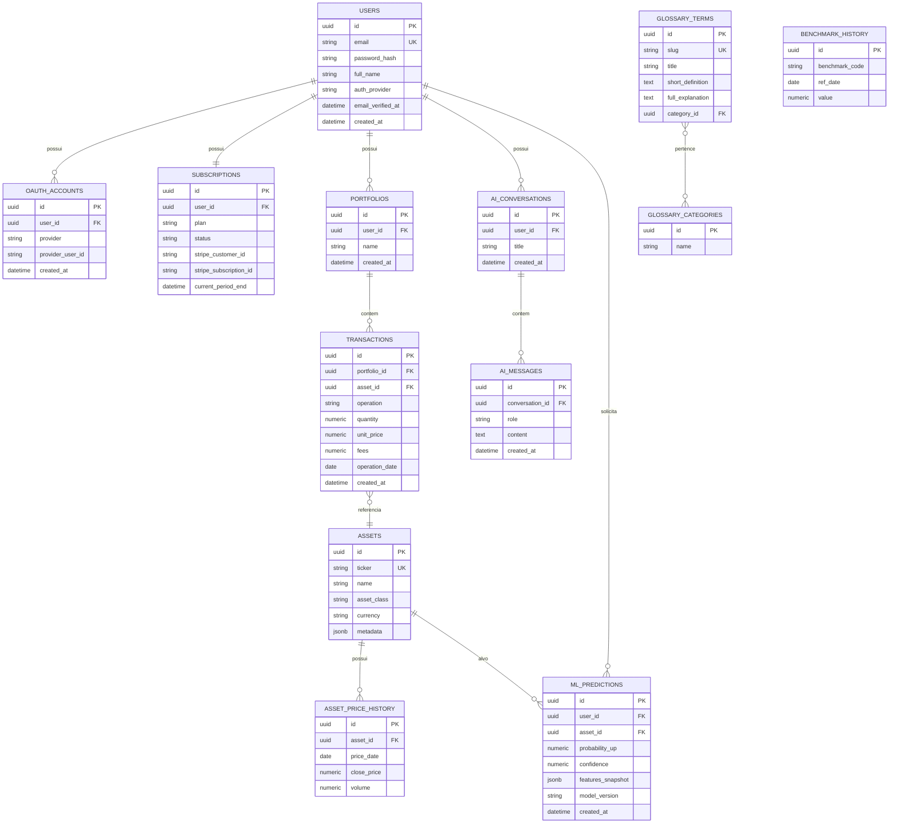

# 3. Modelo de Dados

## 3.1 Diagrama Entidade-Relacionamento

## 3.2 Descrição das tabelas principais

### `users`
Dados de conta. `password_hash` é nulo quando o usuário só usa login via Google. `auth_provider` indica `local` ou `google` (usuário pode ter os dois vinculados via `oauth_accounts`).

### `oauth_accounts`
Suporta múltiplos provedores OAuth por usuário no futuro (hoje só Google), evitando reescrever `users` quando outro provedor for adicionado.

### `subscriptions`
Um registro por usuário (relação 1:1 no MVP). Guarda o `plan` (`free` | `premium`), `status` (`active`, `past_due`, `canceled`) e IDs do Stripe para reconciliação via webhook.

### `portfolios`
Modelado como tabela própria (não só uma FK direta em `users`) para permitir, no futuro, múltiplas carteiras por usuário (ex: "Carteira Pessoal" vs "Carteira Previdência") sem migração estrutural. No MVP, cria-se uma carteira padrão por usuário no cadastro.

### `assets`
Catálogo de ativos suportados (Ações, FIIs, ETFs, Tesouro Direto). Populado/atualizado pelo job de sincronização. `asset_class` é um enum (`acao`, `fii`, `etf`, `tesouro_direto`; extensível para `cdb`, `lci`, `lca`, `debenture`, `fundo` na fase 2).

### `transactions`
Lançamentos manuais de compra/venda. `operation` é enum (`compra`, `venda`). Cálculo de posição atual e preço médio é derivado (não armazenado) a partir das transações — evita inconsistência entre dado bruto e dado calculado.

### `asset_price_history`
Série histórica diária de preços de fechamento por ativo, usada tanto para gráficos do dashboard quanto como matéria-prima do feature engineering do modelo de ML.

### `benchmark_history`
Série histórica de CDI, IPCA e IBOV (`benchmark_code`), usada nas comparações de rentabilidade.

### `glossary_terms` / `glossary_categories`
Base do módulo de Aprendizado (dicionário). Categorias sugeridas: Renda Variável, Renda Fixa, Fundos, Indicadores, Conceitos Gerais (juros compostos, dividendos, etc).

### `ai_conversations` / `ai_messages`
Histórico do chat de IA, por usuário. Permite múltiplas conversas (como no ChatGPT) e é a base para aplicar rate limit por plano (contagem de mensagens no período).

### `ml_predictions`
Registro de cada previsão gerada (fase 2), incluindo o snapshot das features usadas e a versão do modelo — importante para auditoria e para explicar ao usuário que a previsão não é estática.

## 3.3 Decisões de modelagem

- **Cálculo de rentabilidade (método simples/custo médio)**: não requer tabela adicional — é computado em tempo de leitura a partir de `transactions` + `asset_price_history`. Migrar para TWR no futuro exigiria uma tabela de snapshots diários de valor de carteira (`portfolio_daily_snapshot`), já prevista como extensão não-disruptiva.
- **UUID como chave primária** em todas as tabelas, para evitar enumeração sequencial de IDs (boa prática de segurança) e facilitar futura distribuição/sharding.
- **Enums como `VARCHAR` com `CHECK constraint`** (não `ENUM` nativo do Postgres) para facilitar adicionar novos valores (ex: nova `asset_class`) via migration simples, sem `ALTER TYPE`.
