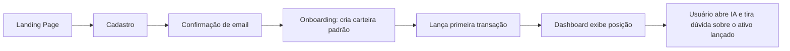
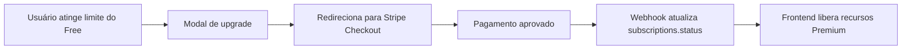

# 5. Telas, Componentes e Fluxos

## 5.1 Landing Page (pública, `/`)

Seções em single-page com navegação por âncora: `Hero`, `Sobre`, `Benefícios`, `Recursos`, `Planos`, `Depoimentos`, `FAQ`, `Contato`, mais botões de `Login` e `Cadastro` no header fixo.

Componentes reutilizáveis: `AppHeader`, `HeroSection`, `BenefitsGrid`, `FeatureShowcase`, `PricingTable`, `TestimonialCarousel`, `FaqAccordion`, `ContactForm`, `AppFooter`.

## 5.2 Autenticação (`/login`, `/registro`, `/esqueci-senha`, `/redefinir-senha`)

Formulários com Naive UI (`n-form`, `n-input`, validação client-side + erros retornados pela API). Botão "Entrar com Google" chama o fluxo OAuth (redirect).

## 5.3 App autenticado — Shell

`AppShell` com `NavigationDrawer` (menu lateral) fixo e `AppBar` no topo (avatar, plano atual, notificações futuras). Rotas protegidas por `router.beforeEach` checando token válido + plano quando aplicável.

Menu lateral: **Home · Carteira · Mercado · Aprendizado · Simulações · IA · Perfil · Configurações**.

## 5.4 Home / Dashboard (`/app/home`)

Grid de cards/gráficos (ApexCharts):
- `PatrimonioCard` (patrimônio total + variação do dia)
- `RentabilidadeChart` (linha: carteira vs CDI vs IPCA vs IBOV)
- `AlocacaoChart` (donut: por classe de ativo)
- `DividendosChart` (barras: dividendos recebidos por mês)
- `EvolucaoPatrimonialChart` (área: evolução do patrimônio no tempo)
- `TopMoversTable` (duas listas: maiores altas / maiores baixas)

## 5.5 Carteira (`/app/carteira`)

- `PositionsTable` — posições atuais (ativo, quantidade, preço médio, preço atual, rentabilidade, % da carteira)
- `TransactionFormDialog` — modal para lançar compra/venda (autocomplete de ativo via `/market/assets`)
- `TransactionsHistoryTable` — histórico com filtros e ações de editar/remover

## 5.6 Mercado (`/app/mercado`)

- `AssetSearchBar`
- `AssetDetailPage` (`/app/mercado/:ticker`) — cotação, gráfico histórico (`AssetPriceChart`), indicadores básicos (P/L, DY, etc. quando disponíveis via brapi.dev), botão "Adicionar à carteira" e (fase 2) "Gerar previsão IA"

## 5.7 Aprendizado (`/app/aprendizado`)

- `GlossaryCategoryList` (lateral ou chips de filtro)
- `GlossarySearchBar`
- `GlossaryTermCard` / `GlossaryTermDetail` — definição curta + explicação completa, com exemplos práticos

## 5.8 Simulações (`/app/simulacoes`)

- `CompoundInterestSimulator` — inputs (aporte inicial, aporte mensal, taxa a.a., prazo) + `CompoundInterestChart`
- `AssetComparisonSimulator` — seleciona 2-3 ativos/indexadores + período, mostra `ComparisonChart` de rentabilidade acumulada

## 5.9 IA (`/app/ia`)

- `ChatSidebar` — lista de conversas
- `ChatWindow` — mensagens estilo ChatGPT, indicador de "digitando", disclaimer fixo no rodapé do chat
- Fase 2: aba/seção `PredictionPanel` — seleciona ativo elegível, mostra `probabilidade`, `confiança`, texto de disclaimer destacado (não é recomendação de investimento; eventos inesperados podem invalidar a previsão)

## 5.10 Perfil (`/app/perfil`) e Configurações (`/app/configuracoes`)

- Perfil: dados pessoais, foto, plano atual e uso (ex: mensagens de IA usadas no mês)
- Configurações: preferências de notificação (futuro), idioma, exclusão de conta, gerenciar assinatura (link para portal Stripe)

## 5.11 Fluxo principal: Cadastro → Primeira carteira → Primeira dúvida na IA

## 5.12 Fluxo: Upgrade de plano

